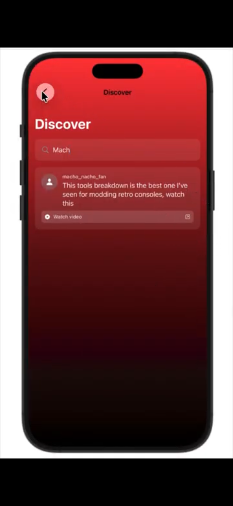
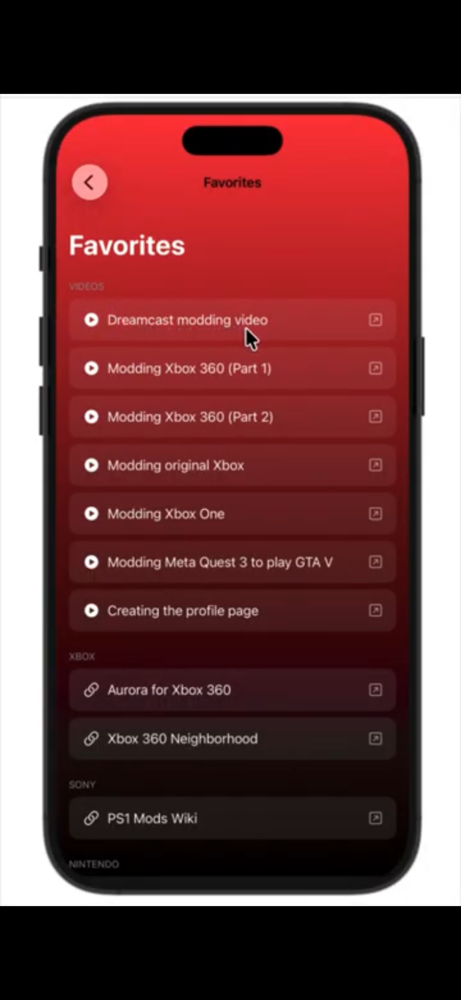
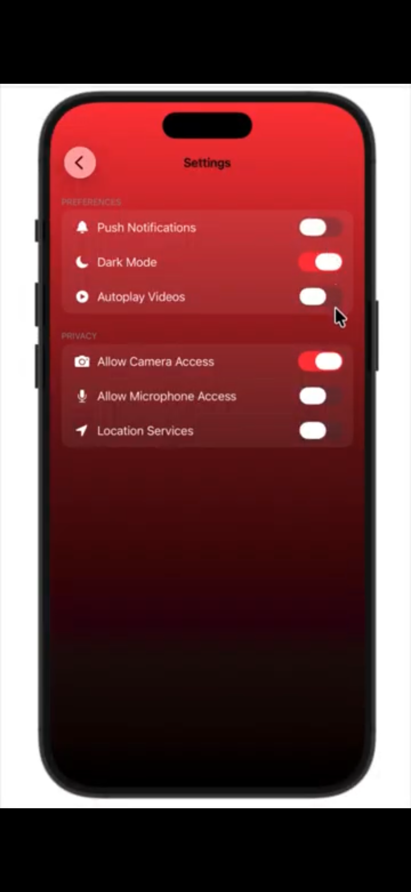

# About "ModThat"

ModThat is a prototype gaming app serving the gaming console community, containing information given by its community on gaming console information.  

This app was created for the **Digital Scholar's: Programming in Swift 2026 Capstone Project** and using the *Swift* programming language!

## Our Team
*Alejandro Corona* - Conceptualized the app, focused on data information & retrieval
 *Christian Sanchez* - Coded the navigation page containing favorite posts, users profile, commenting features, & more
 *Ianna Zambrano* - Designed onboarding graphics design, coded onboarding page & welcome page

## Features of "ModThat"
This page is what greets the user when the user first downloads the app. The following three pages are connected to the "Next" button, allowing the user to either skip to the login screen
or click multiple times to get to the login screen. For this part, I (Ianna) designed the graphics design on Canva after seeing a YouTube tutorial following a similar format. 
   
 
   The login screen pops up after the onboarding page OR after the first time the user opens up the app. One thing to add is the ability to create accounts, because the app has not been coded
to create user accounts. Ianna made this page
 
   This is what pops up after the user log ins. They are given an array of choices, including the bottom icons to decide where to go from there. Christian made this page.
 
   On this page, the user can search up anything to discover posts and forums. Christian made this page.
 
   This page, the user can view what posts they have favorited. Christian made this page.
 
   Next, the "New Post" page allows the user to create and send out new posts. Christian made this page.
 
Lastly, this page allows the user to change its settings. Christian made this page. 

### ** Overall, huge thanks to Alejandro for coming up with the idea and gathering all of the sources. His ability to gather and searched for resources allowed Christian to create the discovers page!

## What To Work On
Currently, this file is slightly corrupted, but is the only file where we were able to connect every button to each page in order to offer our audience a realistic point of view as
first-time users. This is our first, major goal.

Our second goal is coding our future features, most importantly the post and account creation features.

## Future Features
... we decided that because this is a prototype, there are some features that need improvement or implementation!  

      • Improve the functionality
      • Adding the ability to manually create an account
      • A save button for post creations when users click off and want to return later
      • Cyber security, as some users will voice concern over tapping unknown links
      • Older consoles for more coverage

## Inspiration
Because the team were beginners in learning the Swift language during the app prototype stage, we heavily relied on YouTube tutorials and Google websites.  

## What We Learned
As a team, we have collectively agreed that we learned:
      • How to persevere together when our code wouldn´t work (Christian)
      • Asking each other for help is okay, especially when we all don´t know what to do (Everyone)
      • The difference between structures and functions (Alejandro)
      • Coding is NOT easy! (Ianna)

### Other Resources
[Click here to access
our **Google Doc** containing all of our sources!](https://docs.google.com/document/d/1eZeFfT77cZJGt6_ez35BXWkLDoQPuq0Jh62Al6M-eB4/edit?usp=sharing)  
[Click here to access our **Capstone Project** slides!](https://docs.google.com/presentation/d/1Zzq1xC_VoaDFemrhK75jkMD-x-pL8pPVtn-qPewfs2s/edit?usp=sharing)

 

